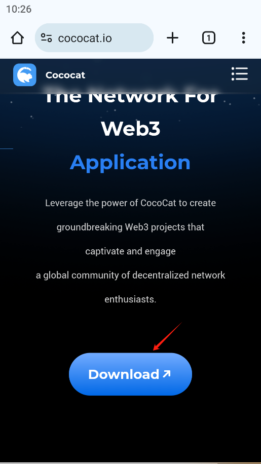
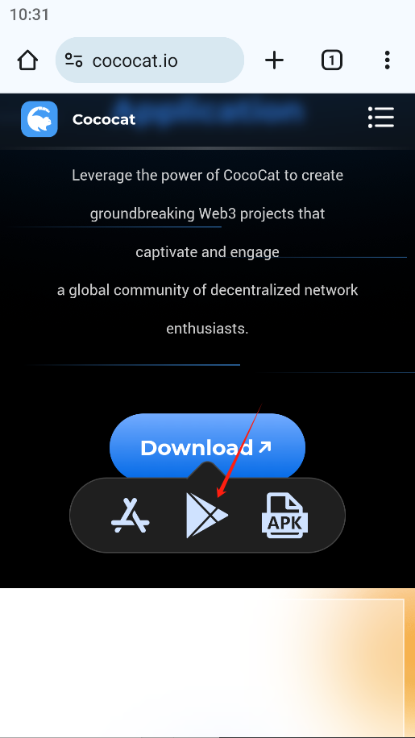
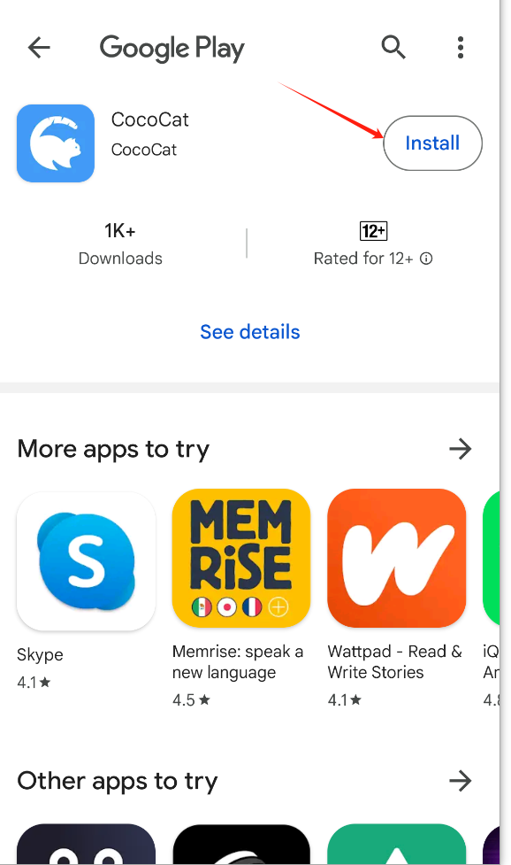
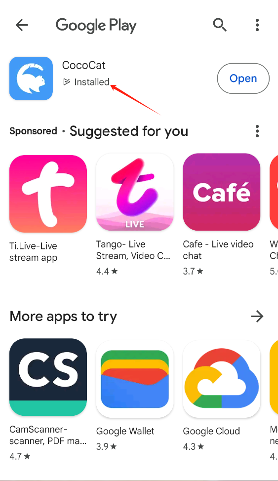
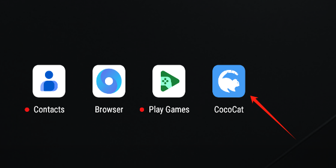

# Download and Install the CocoCat App

Visit the CocoCat website using a browser and click[ here](https://www.cococat.io/) to navigate

1. Click Download

   

2.Click Google Play (ensure you are logged into your Google account for this step). 

Depending on your device, you can choose Google Play, App Store, or directly download the APK file for Android users.

3.Click Install

4.download successful

