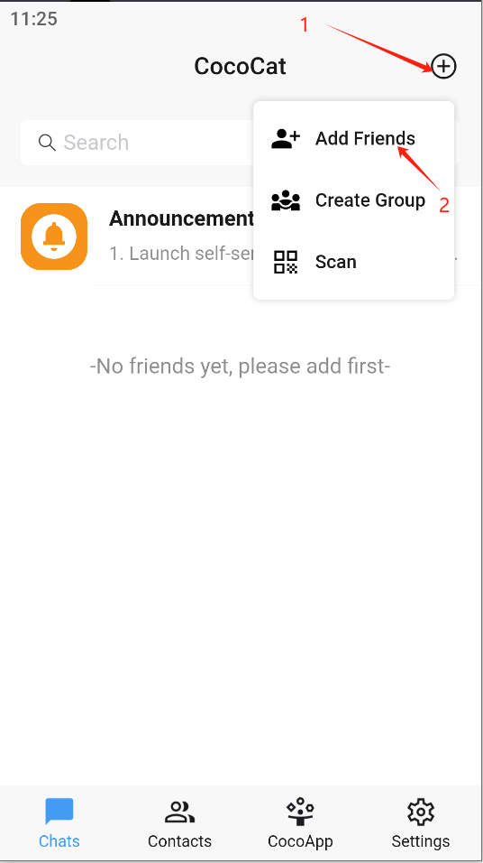
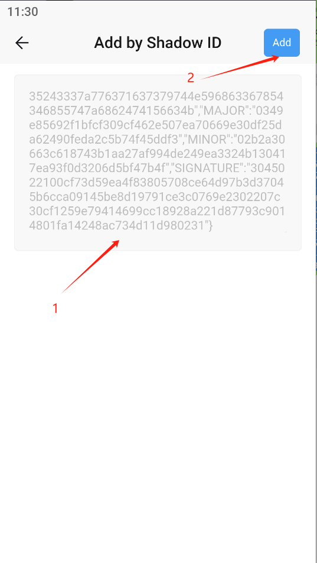
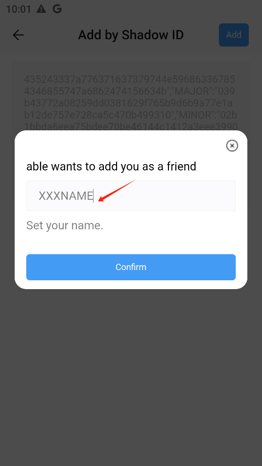
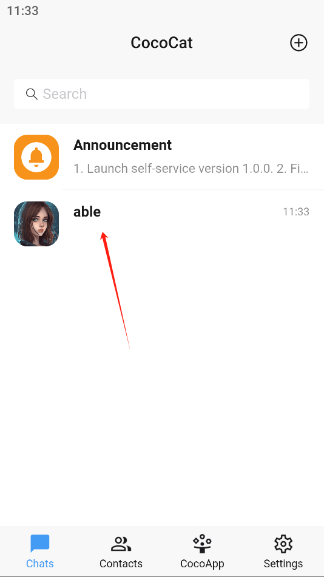

# Using CocoCat app

After successfully downloading CocoCat app

1.Open CocoCat app

2.Click +

3.Click Add via shadow ID

4.Enter Shadow ID and click Add

5.Enter friend's nickname and click Confirm. If successful, it is added successfully. 

If adding fails, please check the network status and try again

6.Display returns to the main interface

