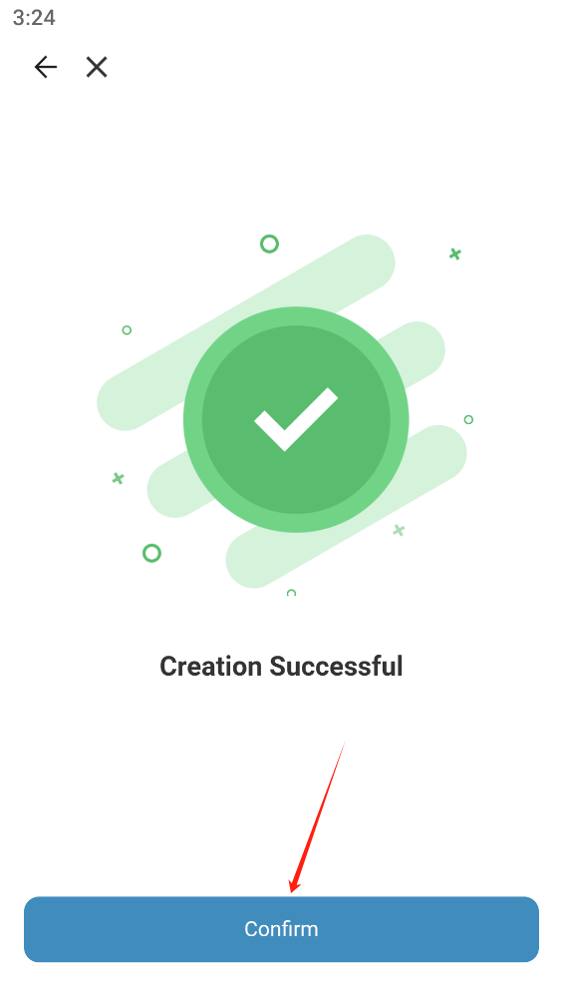

# Create And Import Wallets

**Create a wallet**

1. Click CocoPay

2. Click Create Wallet

3. Select the network (select all here), click Next

4. Enter the password, click Create

5. Creation Successful, click Confirm

**Import wallet**

1. Click the network, then click Import new wallet

2. Select private key import (same for others)

3.Enter the private key, enter the password, and then click Import

4. Import successful

